# Robinson KR — Portfolio Website
## Complete SRS, BRD, Application Flow & Technology Stack

---

# 📋 Business Requirements Document (BRD)

## 1. Project Overview

| Field | Details |
|---|---|
| **Project Name** | Robinson KR — Personal Portfolio Website |
| **Project Owner** | Robinson KR |
| **Type** | Personal Branding & AI-Powered Portfolio |
| **Version** | 1.0 |
| **Date** | February 28, 2026 |

## 2. Business Objectives

| # | Objective |
|---|---|
| BO-1 | Establish a professional online presence showcasing Robinson's backend development expertise |
| BO-2 | Enable visitors to interact with an AI chatbot that answers questions about skills, projects, and experience |
| BO-3 | Provide a streamlined contact mechanism for potential employers/clients |
| BO-4 | Present a downloadable/printable resume in a visually consistent format |

## 3. Target Audience

- **Recruiters & Hiring Managers** — evaluating Robinson's technical profile
- **Potential Clients** — seeking backend development or automation services
- **Peers & Community** — networking and collaboration

## 4. Business Rules

| Rule | Description |
|---|---|
| BR-1 | The chatbot must **only** respond based on Robinson's actual portfolio data (no hallucination) |
| BR-2 | Contact form submissions must be stored reliably (via Google Forms) |
| BR-3 | The website must be fully responsive across desktop, tablet, and mobile |
| BR-4 | Dark/Light theme preference must persist across sessions |

## 5. Success Metrics

- Page load time **< 3 seconds**
- Chatbot responds within **5 seconds**
- Mobile responsiveness score **> 90** (Lighthouse)
- Zero contact form submission failures

---

# 📐 Software Requirements Specification (SRS)

## 1. System Overview

The system is a **two-tier architecture** with an added authentication layer:


| Layer | Technology |
|---|---|
| **Frontend** | HTML5, CSS3, Vanilla JavaScript |
| **Backend** | Python, FastAPI, Uvicorn, SQLite, bcrypt, JWT |
| **AI/ML** | LangChain, Google Gemini (LLM + Embeddings), FAISS |
| **Contact** | Google Forms (serverless) |

---

## 2. Functional Requirements

### FR-1: Portfolio Landing Page (`index.html`)

| ID | Requirement | Priority |
|---|---|---|
| FR-1.1 | Display hero section with name, tagline, typing animation, and social links | High |
| FR-1.2 | Show "About Me" section with profile image, bio, and 8 skill cards | High |
| FR-1.3 | Display work experience timeline (3 positions) | High |
| FR-1.4 | Show project cards (AutoCloud, Winnow, JV Automation) | High |
| FR-1.5 | Display certifications (UiPath, Jiffy.ai, Mashup Stack) | Medium |
| FR-1.6 | Show education details | Medium |
| FR-1.7 | Provide "Get In Touch" contact form | High |

### FR-2: Resume Page (`resume.html`)

| ID | Requirement | Priority |
|---|---|---|
| FR-2.1 | Display formatted résumé with all sections | High |
| FR-2.2 | Support **Print / Save as PDF** via browser print dialog | High |
| FR-2.3 | Include print-specific CSS for clean paper output | Medium |

### FR-3: Theme System

| ID | Requirement | Priority |
|---|---|---|
| FR-3.1 | Toggle between Dark and Light themes | High |
| FR-3.2 | Persist theme choice in `localStorage` | High |
| FR-3.3 | Apply saved theme **before first paint** (prevent flash) | Medium |

### FR-4: Contact Form

| ID | Requirement | Priority |
|---|---|---|
| FR-4.1 | Collect Name, Email, and Message fields | High |
| FR-4.2 | Submit via `POST` to Google Forms endpoint | High |
| FR-4.3 | Submit in hidden `<iframe>` to prevent page redirect | High |
| FR-4.4 | Display success confirmation popup after submission | High |

### FR-5: AI Chatbot

| ID | Requirement | Priority |
|---|---|---|
| FR-5.1 | Floating chat bubble visible on all pages | High |
| FR-5.2 | Toggle chat window open/close on bubble click | High |
| FR-5.3 | Send user messages via `POST /chat` to FastAPI backend | High |
| FR-5.4 | Display typing indicator (`...`) while awaiting response | Medium |
| FR-5.5 | Show bot avatar alongside AI responses | Medium |
| FR-5.6 | Gracefully handle backend connection failures | High |

### FR-6: Backend RAG Engine

| ID | Requirement | Priority |
|---|---|---|
| FR-6.1 | Extract portfolio text from HTML files via `extract_data.py` | High |
| FR-6.2 | Split knowledge base into 1000-char chunks (100 overlap) | High |
| FR-6.3 | Generate embeddings using `gemini-embedding-001` | High |
| FR-6.4 | Store/load vectors in FAISS index on disk | High |
| FR-6.5 | Retrieve relevant chunks and answer via `gemini-flash-latest` LLM | High |
| FR-6.6 | Constrain answers to provided context only | High |

### FR-7: UI Animations & Interactions

| ID | Requirement | Priority |
|---|---|---|
| FR-7.1 | Scroll-reveal animations (fade up, fade left) via `IntersectionObserver` | Medium |
| FR-7.2 | Staggered card entrance animations for grids | Medium |
| FR-7.3 | Hero section typing effect | Medium |
| FR-7.4 | Scroll progress bar at top of page | Low |
| FR-7.5 | Smooth scrolling for anchor navigation | Medium |
| FR-7.6 | Floating code-symbol background elements | Low |

### FR-8: Admin Dashboard Authentication

| ID | Requirement | Priority |
|---|---|---|
| FR-8.1 | Provide a hidden `/admin.html` login portal | High |
| FR-8.2 | Authenticate admin user against a local SQLite database | High |
| FR-8.3 | Issue temporary JSON Web Tokens (JWT) for session management | High |
| FR-8.4 | Provide protected endpoints (`/admin/dashboard_data`, `/admin/visitors`) accessible only via Bearer token | High |
| FR-8.5 | Prevent unauthorized access to portfolio analytics and AI retrain functions | High |

### FR-9: Site Visitor Analytics

| ID | Requirement | Priority |
|---|---|---|
| FR-9.1 | Automatically trigger a background `POST` to `/track_visit` on page load | High |
| FR-9.2 | Capture visitor IP address (handling proxy/Vercel headers) | High |
| FR-9.3 | Parse and store User-Agent strings (Browser & OS details) | Medium |
| FR-9.4 | Log the specific page visited (`/index.html` or `/resume.html`) | High |
| FR-9.5 | Display tracked visits securely within the Admin UI table | High |

---

## 3. Non-Functional Requirements

| ID | Requirement | Category |
|---|---|---|
| NFR-1 | Responsive design from 320px to 4K displays | Usability |
| NFR-2 | CORS enabled on backend (`allow_origins=["*"]`) — restrict in production | Security |
| NFR-3 | API key stored in `.env`, never committed to repo | Security |
| NFR-4 | FAISS index cached on disk to avoid re-indexing | Performance |
| NFR-5 | Lazy init of RAG chain (first request triggers setup) | Performance |
| NFR-6 | Semantic HTML5 with proper `aria-label` attributes | Accessibility |
| NFR-7 | Google Fonts loaded with `preconnect` for speed | Performance |

---

## 4. API Specification

### `GET /`
> Health check

**Response:** `{"message": "AI Chatbot Backend is running!"}`

### `POST /chat`
> Send a user message and receive an AI-generated response

**Request Body:**
```json
{
  "message": "What projects has Robinson worked on?"
}
```

**Success Response (200):**
```json
{
  "response": "Robinson has built AutoCloud, Winnow Hiring Portal, and a Journal Vouchers Automation system..."
}
```

**Error Responses:**

| Code | Condition |
|---|---|
| 400 | Empty message |
| 500 | RAG engine or Gemini API failure |

---

# 🔄 Application Flow

## User Journey Flow

```mermaid
graph TD
    A["User Opens Website"] --> B["Theme Applied from localStorage"]
    A --> A1["POST /track_visit (Background)"]
    A1 --> A2["Backend logs IP & Agent to SQLite"]
    B --> C["Hero Section + Typing Animation"]
    C --> D{"User Scrolls?"}
    D -->|Yes| E["Sections Reveal with Animations"]
    D -->|No| F{"User Clicks Nav?"}
    F -->|Yes| G["Smooth Scroll to Section"]
    
    E --> H{"User Action"}
    H -->|"Clicks Chat Bubble"| I["Chat Window Opens"]
    I --> J["User Types Message"]
    J --> K["POST to /chat"]
    K --> L["RAG: Retrieve → Generate"]
    L --> M["AI Response Displayed"]
    M --> J
    
    H -->|"Fills Contact Form"| N["POST to Google Forms"]
    N --> O["Success Popup Shown"]
    
    H -->|"Clicks Resume"| P["resume.html Loads"]
    P --> Q{"Print?"}
    Q -->|Yes| R["Print CSS Applied → PDF"]
```



## AI Chatbot Data Flow (RAG Pipeline)


## Key Flow Details

### 1. First Load Sequence
1. Browser requests `index.html`
2. **Pre-paint script** reads `localStorage('theme')` → sets `data-theme` attribute
3. CSS loads (`style.css`, `chat.css`) → theme variables applied
4. `main.js` initializes: theme toggle, hamburger menu, `IntersectionObserver`, typing effect, scroll bar
5. `chat.js` initializes: chat bubble click handler, message submission handler

### 2. Chat Message Flow
1. User clicks chat bubble → window toggles to `display: flex`
2. User types message → submits form
3. `addMessage(message, 'user')` renders user bubble
4. `addTypingIndicator()` shows `...` animation
5. `fetch('http://localhost:8000/chat', {method: 'POST', body: {message}})` fires
6. Backend: `get_answer()` → lazy-inits RAG chain if needed → `rag_chain.invoke({input: query})`
7. Response returned → typing indicator removed → bot message displayed

### 3. Contact Form Flow
1. User fills Name, Email, Message
2. Form `POST`s to Google Forms URL via hidden `<iframe>` (prevents redirect)
3. After 500ms timeout, success popup shown
4. Form fields reset

---

# 🛠️ Technology Stack

## Frontend

| Technology | Purpose | Version/Source |
|---|---|---|
| **HTML5** | Semantic page structure | — |
| **CSS3** | Styling, animations, CSS variables for theming | Custom (`style.css`, `chat.css`) |
| **Vanilla JavaScript** | Interactivity, DOM manipulation, API calls | ES6+ (`main.js`, `chat.js`, `admin.js`) |
| **Google Fonts** | Typography — Inter (UI) + Fira Code (mono) | CDN |
| **Font Awesome 6.4** | Icons | CDN |

## Backend & Authentication

| Technology | Purpose | Version |
|---|---|---|
| **Python** | Backend runtime | 3.x |
| **FastAPI** | REST API framework | Latest |
| **Uvicorn** | ASGI server | Latest |
| **SQLite / SQLAlchemy** | Local database & ORM for user storage | Latest |
| **python-jose / bcrypt** | JWT token generation & password hashing | Latest |
| **Pydantic** | Request/response validation | >=2.0 |

## AI / ML Stack

| Technology | Purpose |
|---|---|
| **LangChain** | RAG orchestration framework |
| **LangChain Google GenAI** | Gemini LLM + Embeddings integration |
| **LangChain Community** | FAISS vector store, TextLoader |
| **Google Gemini** | `gemini-flash-latest` (LLM) + `gemini-embedding-001` (embeddings) |
| **FAISS (CPU)** | Local vector similarity search |
| **BeautifulSoup4** | HTML → text extraction for knowledge base |

## Infrastructure & Tools

| Technology | Purpose |
|---|---|
| **Google Forms** | Serverless contact form backend |
| **localStorage** | Client-side theme persistence |
| **python-dotenv** | Environment variable management |
| **Git / GitHub** | Version control |

---

## Project File Structure

```
robinson-portfolio-main/
├── index.html              # Main portfolio page
├── resume.html             # Printable resume page
├── admin.html              # Private admin login/dashboard page
├── css/
│   ├── style.css           # Main stylesheet (theming, layout, mobile queries)
│   ├── chat.css            # Chatbot widget styles
│   └── admin.css           # Admin dashboard UI styles
├── js/
│   ├── main.js             # Theme toggle, nav, animations, contact form
│   ├── chat.js             # Chatbot open/close, message API client
│   └── admin.js            # JWT session management & protected API requests
├── images/
│   └── profile_avatar.png  # Profile picture
├── backend/
│   ├── main.py             # FastAPI app with /chat, /token, and /admin endpoints
│   ├── auth.py             # JWT generation and bcrypt password hashing
│   ├── database.py         # SQLAlchemy config & User model table
│   ├── rag_engine.py       # RAG pipeline: load → chunk → embed → retrieve → answer
│   ├── extract_data.py     # HTML-to-text extraction for knowledge base
│   ├── knowledge_base.txt  # Extracted portfolio text (auto-generated)
│   ├── faiss_index/        # Persisted FAISS vector index
│   ├── requirements.txt    # Python dependencies
│   ├── .env                # API keys (not committed)
│   └── .env.example        # Template for env vars
├── venv/                   # Python virtual environment
└── .gitignore
```

---

## Deployment Notes

| Concern | Current State | Production Recommendation |
|---|---|---|
| **CORS** | `allow_origins=["https://robinsonkr.vercel.app", ...]` | Restricted to portfolio domain ✅ |
| **Chat URL** | Dynamic detection based on hostname | Production points to Render URL ✅ |
| **HTTPS** | Enabled by default on Vercel/Render | Handled by platform ✅ |
| **Backend hosting** | Deployed to **Render** | `https://antigravity-projects-dn90.onrender.com/` ✅ |
| **Frontend hosting** | Deployed to **Vercel** | `https://robinsonkr.vercel.app/` ✅ |
| **API Key** | `.env` file | Use secret manager in production |
